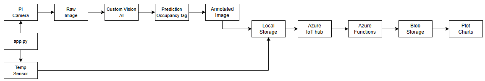
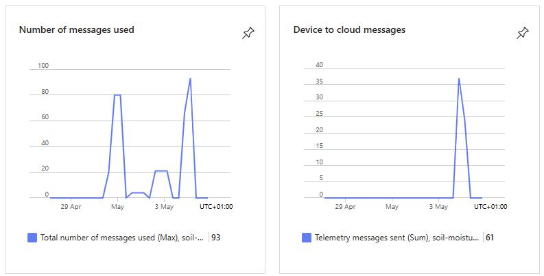
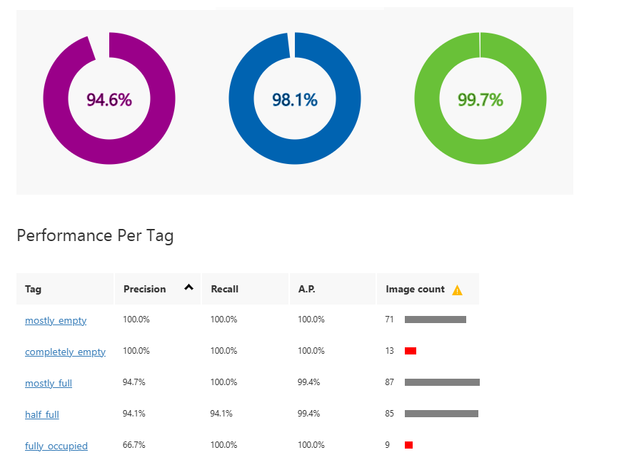
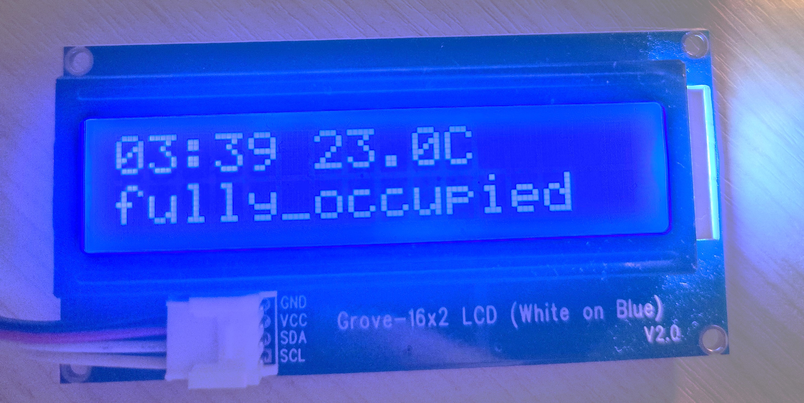
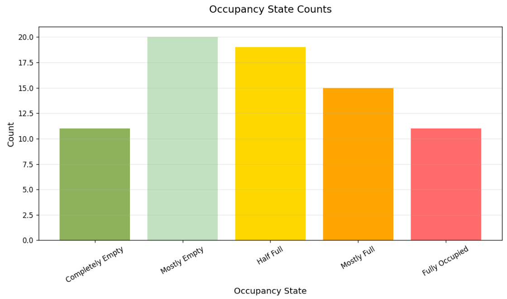
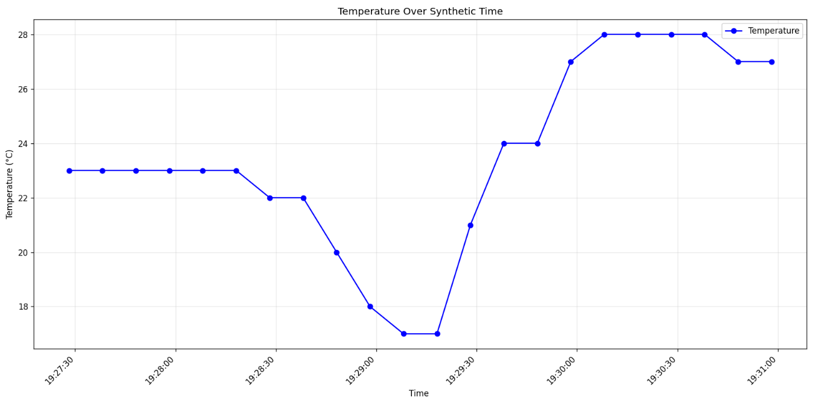

# IoT Parking Monitoring System with Azure Integration   🚗
*A Raspberry Pi-powered solution for smart parking management with **AI-powered visual classification***   

---

## 📌 Table of Contents  
- [Project Overview](#-project-overview)  
- [System Architecture](#-system-architecture)  
- [Prerequisites](#-prerequisites)  
- [Setup & Installation](#-setup--installation)  
- [Data Flow](#-data-flow)  
- [Custom Vision](#-custom-vision)  
- [IoT Storage](#-iot-storage)  
- [Data Visualization](#-data-visualization)  
- [Project Demo](#-project-demo)  
- [Troubleshooting](#-troubleshooting)  
- [Challenges & Solutions](#-challenges--solutions)  

---

## 📷 Project Overview  
### **Smart parking meets AI vision** 
This system combines Raspberry Pi hardware with Azure cloud services to monitor a parking spaces and detect occupancy levels using Azure Custom Vision AI. 
Predictions are sent to Azure IoT Hub, processed with Azure Functions, stored in Blob Storage, and visualized through Python-based analytics. 

### **Features:**
- Establishes a secure connection with Azure IoT Hub  
- Captures parking lot images using Pi Camera  
- Monitors temperature with DHT11 sensor  
- Classifies parking occupancy using Azure Custom Vision AI  
- Displays time, temperature and occupancy on LCD screen  
- Transmits JSON telemetry to Azure IoT Hub  
- Annotates images with occupancy and temperature data  
- Stores time-stamped data locally and in Azure Blob  
- Generates charts from blob storage data  

---

## 📐 System Architecture  

---

## 📦 Prerequisites  
### **Hardware**  
- Raspberry Pi 4 
- Grove base hat for Raspberry PI
- Raspberry Pi Camera v2 
- Grove temperature and humidity sensor (DHT11)
- Grove - 16 x 2 LCD
- Parking (in my case DIY)


### **Software**  
- Raspberry Pi OS (Legacy 32-bit) Lite - BULLSEYE
- Python 3.9  
- Azure IoT Hub, Blob Storage, and Function App configured
- Custom Vision AI Project
- Install dependencies from the included requirements file:  

```bash
pip install -r requirements.txt 

```
## 🔧 Installation & Usage

### **Installation**  
 **1. Clone the Repository**
```bash
git clone https://github.com/MalgorzataVictor/IoTProject
cd iot-parking-system
```

**2. Install Dependencies**
```bash
pip install -r requirements.txt
```

**3. Set Up Azure Services (locally)**
```bash
func azure functionapp publish parking-system-function 
```
### **Configuration**  

**1. Environment Setup**  
Create config.json file in project root with own settings
```bash
{
    "prediction_url": "",
    "prediction_key": "",
    "connection_string": "",
    "storage_connection_string": "",
    "storage_container": ""
}

```
**2. Hardware Configuration** 
| Component       | Connection               |
|-----------------|--------------------------|
| 📷 Pi Camera    | CSI Port                 |
| 🌡️ DHT11 Sensor | GPIO 5 (Pin 29)          |
| 🖥️ LCD Display  | I2C (Address `0x3E`)     |

*Remember to enable Legacy Camera (Bullseye/Buster OS) using sudo 'raspi-config'*

### **Usage**  

**1. Start the System - monitoring** 
```bash
python app.py 
```
**2. Plotting the graphs** 
```bash
python plot_from_blob.py
```

---

## 🌀 Data Flow  



1. **Data Acquisition**:
   Image Capture: Raspberry Pi uses the Pi Camera to take periodic photos of the parking area.
   Temperature Reading: A temperature sensor captures ambient temperature alongside image capture.

2. **Local Processing**:
   Custom Vision API: Images are sent to Azure Custom Vision, which returns prediction tags (e.g., `mostly_full`, `empty`).
   Annotation: The image is annotated with prediction and temperature before being stored locally.

3. **Telemetry Transmission**:
   JSON Packaging: Timestamp, temperature, and prediction tags are structured into a JSON payload.
   IoT Hub Communication: Payloads are transmitted to Azure IoT Hub.

4. **Cloud Processing**:
   Azure Functions: Triggered by IoT Hub messages to log and forward telemetry to Blob Storage.

5. **Data Storage**:
   Blob Storage: Receives and stores telemetry in organized JSON format for easy retrieval.

6. **Visualization**:
   Data Retrieval: A local script fetches data from Blob Storage.
   Plot Generation: Graphs for temperature trends and occupancy statistics are created and displayed on the Pi.


### **Telementry Payload**
```bash
{
  "timestamp": "2024-05-20T14:30:00Z",
  "device_id": "parking-pi-01",
  "temperature": 23.5,
  "occupancy": "mostly_empty",
  "confidence": 0.92
}
```



    

---

## 👁️ Custom Vision  
The system leverages Azure Custom Vision’s image classification model, trained on 200+  parking lot images. The model distinguishes five occupancy states, defined by precise capacity ranges: **completely_empty** (0%), **mostly_empty** (10-30%), **half_full** (40-60%), **mostly_full** (70-90%), and **fully_occupied** (100%).


### **Integration Workflow:**

1.Configuration: The app.py script loads the Custom Vision endpoint and prediction key from config.json, dynamically extracting the project ID and iteration name from the prediction URL.

2.Real-Time Inference: Each captured image is sent to the trained model, which returns both the occupancy classification (e.g., "mostly_empty") and a confidence score (0–1). 

3.Edge Processing: Results are locally annotated on images (saved to parking_images/) and packaged into JSON telemetry for Azure IoT Hub




*AI classifies parking states with high accuracy, working best for empty spots and needing minor improvements for full occupancy detection.*

---

## 🗄️ IoT Storage  
### **Local**
- **Raw Images**: Captured by the Pi Camera before annotation.
- **Annotated Images**: Include Custom Vision predictions and sensor data.
- **Logs**: `logs.txt` tracks script activity, errors, and operational events.

```bash
2025-05-05T00:41:21 - 23.0°C - completely_empty
2025-05-05T00:41:32 - 23.0°C - half_full
2025-05-05T00:41:44 - 22.0°C - half_full
2025-05-05T00:41:56 - 22.0°C - fully_occupied
2025-05-05T00:42:08 - 22.0°C - mostly_empty
2025-05-05T00:42:19 - 22.0°C - completely_empty
2025-05-05T00:42:31 - 22.0°C - half_full
2025-05-05T00:42:42 - 22.0°C - half_full
2025-05-05T00:42:54 - 22.0°C - mostly_empty
2025-05-05T00:43:06 - 23.0°C - fully_occupied
2025-05-05T00:43:17 - 23.0°C - half_full
2025-05-05T00:43:28 - 23.0°C - fully_occupied
2025-05-05T00:43:40 - 24.0°C - mostly_full
2025-05-05T00:43:51 - 24.0°C - mostly_full
```

### **Azure Blob**

JSON-encoded telemetry is stored in Azure Blob Storage. Messages are base64 encoded by Event Hub, decoded in plot_from_blob.py. Each blob contains multiple newline-delimited messages. Example:
```bash
{"EnqueuedTimeUtc":"2025-05-04T23:41:21.3940000Z","Properties":{},"SystemProperties":{"connectionDeviceId":"soil-moisture-sensor","connectionAuthMethod":"{\"scope\":\"device\",\"type\":\"sas\",\"issuer\":\"iothub\"}","connectionDeviceGenerationId":"638765239356645892","enqueuedTime":"2025-05-04T23:41:21.3940000Z"},"Body":"eyJ0aW1lc3RhbXAiOiAiMjAyNS0wNS0wNVQwMDo0MToyMS4zMDM0NjgiLCAidGVtcGVyYXR1cmUiOiAyMywgIm9jY3VwYW5jeSI6ICJjb21wbGV0ZWx5X2VtcHR5In0="}
{"EnqueuedTimeUtc":"2025-05-04T23:41:32.9560000Z","Properties":{},"SystemProperties":{"connectionDeviceId":"soil-moisture-sensor","connectionAuthMethod":"{\"scope\":\"device\",\"type\":\"sas\",\"issuer\":\"iothub\"}","connectionDeviceGenerationId":"638765239356645892","enqueuedTime":"2025-05-04T23:41:32.9560000Z"},"Body":"eyJ0aW1lc3RhbXAiOiAiMjAyNS0wNS0wNVQwMDo0MTozMi44NjQwNTUiLCAidGVtcGVyYXR1cmUiOiAyMywgIm9jY3VwYW5jeSI6ICJoYWxmX2Z1bGwifQ=="}

```

---

## 📊 Data Visualization  

### **Real-time Data Visualisation**
The Raspberry Pi LCD module displays live sensor readings including temperature and AI-predicted parking occupancy. This real-time feedback enables immediate local insight into space availability.



### **Blob Data Summary Output**
Example output from the data visualization script showing parsed telemetry stored in Azure Blob. Each record includes timestamp, temperature, and occupancy state — all used to build historical trends.

```bash
Found 3 blobs in container

Total records processed: 24

First 50 records:
    timestamp                      temperature   occupancy
0  2025-05-04 00:04:29.351795    21.0          fully_occupied
1  2025-05-04 00:04:40.746437    21.0          mostly_empty
2  2025-05-04 00:04:52.623365    21.0          mostly_empty
3  2025-05-04 00:05:04.206588    21.0          mostly_empty
4  2025-05-04 00:05:15.517841    21.0          completely_empty
5  2025-05-04 00:05:26.933891    21.0          mostly_full
6  2025-05-04 00:40:06.441922    22.0          completely_empty
7  2025-05-04 00:40:18.009998    22.0          mostly_full
8  2025-05-04 00:40:29.998944    22.0          mostly_empty
9  2025-05-04 00:40:42.760932    22.0          fully_occupied
10 2025-05-04 00:40:54.184440    22.0          half_full
11 2025-05-04 00:41:06.020910    22.0          half_full
12 2025-05-04 00:41:17.689049    23.0          half_full
13 2025-05-04 00:41:29.210591    23.0          half_full
14 2025-05-04 00:41:40.554387    23.0          completely_empty
15 2025-05-04 00:52:50.339505    22.0          fully_occupied
16 2025-05-04 00:53:02.581890    22.0          mostly_empty
17 2025-05-04 00:53:14.154186    22.0          mostly_empty
18 2025-05-04 00:53:25.726458    21.0          mostly_full
19 2025-05-04 00:53:37.083280    21.0          fully_occupied
20 2025-05-04 00:53:49.914968    20.0          mostly_empty
21 2025-05-04 00:54:01.263455    20.0          half_full
22 2025-05-04 00:54:13.250054    20.0          mostly_empty
23 2025-05-04 00:54:25.012367    20.0          mostly_full

```

### **Visulaisation**
Occupancy trends over time, illustrating the dynamic nature of parking lot usage. This graph is generated from decoded telemetry data retrieved from Azure Blob.
 

Temperature variations logged during the monitoring period. The data can help correlate environmental conditions with occupancy patterns.



---

## 🎬 Project Demo  

---

## ⚠️ Troubleshooting  

### **1.  Camera Not Enabled**
**Error**: 

  ```bash
mmal: mmal_vc_component_enable: failed to enable component: ENOSPC
mmal: camera component couldn't be enabled
mmal: main: Failed to create camera component
Traceback (most recent call last):
  ...
  picamera.exc.PiCameraError: Camera is not enabled
  ...
  mmal: Failed to enable camera
vc.ril.cameraerror
```

**Fix**:  
  ```bash
  sudo raspi-config  
  # Go to Interface Options → Camera → Enable
  sudo reboot
  vcgencmd get_camera  # Verify "supported=1 detected=1"
```

### **2. Camera Module Not Detected**
**Error**: 
  ```bash
mmal: Cannot read camera info, keeping the defaults for OV5647
mmal: Failed to create camera component
mmal: No data received from sensor. Check all connections, including the Sunny one on the camera board
```

**Fix**:  
- Check flat cable orientation and if camera is securely inserted

### **3.  Custom Vision Output is Inaccurate**
**Error**: 
  ```bash
Images are always classified as mostly_full regardless of content.
```

**Fix**:  
- Re-evaluate the model training set in Custom Vision
- Increase training data for edge cases (e.g., full/empty extremes)
- Retrain model with Advanced Training for better results
- Check image quality (blurriness, lighting)

### **3.  Plotting Script Crashes**
**Error**: 
  ```bash
UnicodeDecodeError: 'utf-8' codec can't decode byte 0x80 in position 0
```

**Fix**:  
- Make sure blobs are base64-decoded before parsing JSON
-Check if the blob contains binary files or corrupt entries

### **4.  IoT Hub Connection Error**
**Error**: 
  ```bash
azure.iot.device.iothub.exceptions.ConnectionFailedError: Could not connect to IoT Hub
```

**Fix**:  
- Double-check connection_string in config.json
- Ensure device is registered in IoT Hub and primary key is correct
- Check network connection on Raspberry Pi
- Make sure port 8883 (MQTT) is not blocked by firewall


### **5.  Plotting Script Crashes**
**Error**: 
  ```bash
UnicodeDecodeError: HTTPError: 401 Client Error: Unauthorized for url
```

**Fix**:  
- Verify prediction_key and prediction_url in config.json
- Make sure correct endpoint region is used in the URL
- Check that the key has not expired or been regenerated


  ---

  
## ⚔️ Challenges  

---